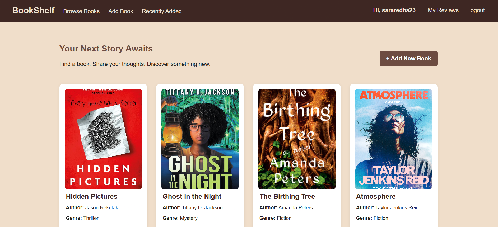
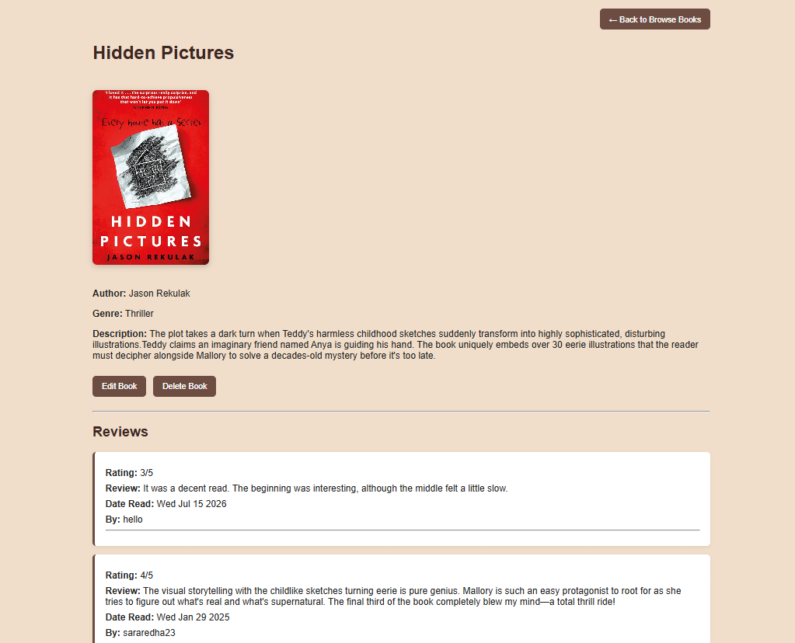

# BookShelf

## Overview

BookShelf is a full-stack MEN (MongoDB, Express, Node) app where signed-in users can browse a shared book catalog and write, edit, or delete their own ratings and reviews. Guests can view the catalog but must sign in to create, update, or delete any content.

[Deployed App](#) 
https://project2-2-3oro.onrender.com/

## Screenshots

## Technologies Used

- MongoDB / Mongoose

- Express.js

- Node.js

- EJS

- express-session & bcrypt (authentication)

- HTML5, CSS3

## Getting Started

[Planning materials](#) 

## User Stories

- As a guest, I want to sign up for an account so that I can start reviewing books.

- As a guest, I want to sign in so that I can access my account.

- As a user, I want to sign out so that my session ends securely.

- As a user, I want to see a list of all books in the catalog so that I can find ones I've read.

- As a user, I want to add a new book to the catalog so that I can share it with other users.

- As a user, I want to view a single book's details along with all its reviews so that I can see what others thought.

- As a user, I want to write a review (rating + text) for a book so that I can share my opinion.

- As a user, I want to edit my own review so that I can update it if my opinion changes.

- As a user, I want to delete my own review so that I can remove it if I want.

- As a user, I want to edit or delete a book I added so that I can fix mistakes.

- As a guest, I should not be able to create, edit, or delete books or reviews, so that only signed-in users can modify data.

## Database Design

**Entities:**

- **User** — `_id`, `username`, `password`

- **Book** — `_id`, `title`, `author`, `genre`, `description`, `createdBy` (FK)

- **Review** — `_id`, `rating`, `comment`, `dateRead`, `user` (FK), `book` (FK)

**Relationships:**

- One `User` has many `Books`

- One `User` has many `Reviews`

- One `Book` has many `Reviews`

- Each `Book` belongs to the `User` who created it

- Each `Review` belongs to a `User` and a `Book`

## Routes

| Method | Route | Description |
|---------|-------|-------------|
| GET | / | Home page |
| GET | /auth/sign-up | New user form |
| POST | /auth/sign-up | Create user, log in |
| GET | /auth/sign-in | Sign-in form |
| POST | /auth/sign-in | Log in user |
| GET | /auth/sign-out | Log out user |
| GET | /books | List all books |
| GET | /books/new | New book form |
| POST | /books | Create book |
| GET | /books/:id | View book & its reviews |
| GET | /books/:id/edit | Edit book form |
| PUT | /books/:id | Update book |
| DELETE | /books/:id | Delete book |
| POST | /books/:bookId/reviews | Create review |
| GET | /books/:bookId/reviews/:id/edit | Edit review form |
| PUT | /books/:bookId/reviews/:id | Update review |
| DELETE | /books/:bookId/reviews/:id | Delete review |

## Features

- Session-based authentication (sign up, sign in, sign out)

- Full CRUD on books and reviews

- Only the user who created a book can edit or delete it

- Only the review's owner can edit or delete it

- Guests can browse but not modify data

## Future Enhancements

- Average rating
- Search/filter
- User reading lists
- Mark books as Want to Read / Reading / Read
- User profile pages
- Favorite books

## Credits
cloudinary
